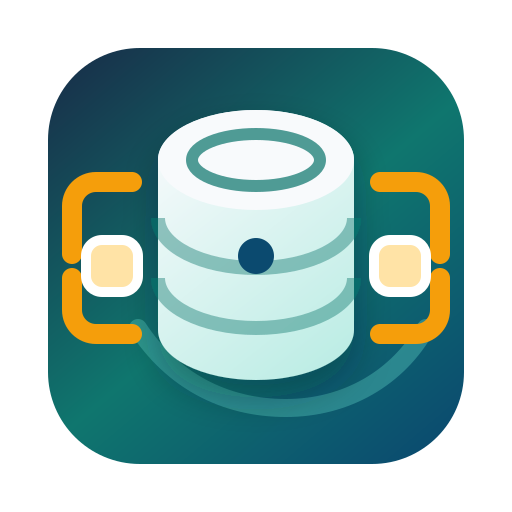

<p align="center">
  
</p>

# drawDB Desktop

[](https://github.com/hjosugi/drawdb-desktop/actions/workflows/ci.yml)

[日本語](README.ja.md)

An integrated Tauri desktop edition of [drawDB](https://github.com/drawdb-io/drawdb).
The application, desktop modules, and Tauri backend live in this repository and
build directly—there is no overlay checkout or manual patch step.

## Desktop features

- Native `.ddb` files with deterministic, diff-friendly JSON
- `.ddbpack` project import/export
- Excel `.xlsx` import/export
- Oracle, MySQL, and PostgreSQL DDL import/export
- Local compressed history with retention controls and corrupt-file recovery
- File associations and single-instance open-file routing on Windows, macOS,
  and Linux
- Autosave with a three-way Save / Discard / Cancel close guard, including
  application-level quit requests
- Signed Tauri updater metadata with startup and manual update checks
- EN/JA desktop messages

## Downloads

GitHub Actions builds release artifacts for the following targets. See
[`docs/release-packaging.md`](docs/release-packaging.md) for packaging policy and
[`docs/validation-matrix.md`](docs/validation-matrix.md) for automated and
physical validation status.

| Platform | Architectures | Formats |
| --- | --- | --- |
| Windows | x64 | NSIS `.exe`, MSI `.msi` |
| Windows | ARM64 | NSIS `.exe` |
| macOS | Intel, Apple Silicon | `.dmg`, `.app` |
| Linux | x64, ARM64 | `.deb`, `.rpm`, `.AppImage` |

Windows NSIS and MSI installers bundle the WebView2 Runtime offline installer.
Linux `.deb` and `.rpm` packages register drawDB MIME metadata for `.ddb` and
`.ddbpack`. CI Fedora-install-and-headless-launch-smoke-tests the Linux x64 RPM.
AppImage file associations require integration through Gear Lever,
appimaged, or an equivalent tool.

The application uses Tauri's signed updater. Release builds publish
`latest.json` and detached updater signatures. Maintainers must configure
`TAURI_SIGNING_PRIVATE_KEY` and, for encrypted keys,
`TAURI_SIGNING_PRIVATE_KEY_PASSWORD`. Windows Authenticode and Apple Developer
ID/notarization are conditional on their platform credentials; unsigned macOS
builds receive an ad-hoc signature so the bundle and updater archive remain
internally consistent.

## Development

Requirements: Node.js 20.19+, npm, Rust/Cargo, and the platform-specific Tauri
prerequisites.

```sh
npm ci
npm run desktop:dev
```

Production builds are created directly from the repository root:

```sh
npm run desktop:build
```

The exact imported upstream revision and merge procedure are documented in
[`UPSTREAM.md`](UPSTREAM.md).

## Headless CLI

The CLI validates and converts `.ddb` files without launching the desktop UI.
See [`docs/headless-cli.md`](docs/headless-cli.md).

```sh
node scripts/drawdb-cli.mjs validate schema.ddb
node scripts/drawdb-cli.mjs export --to sql --dialect postgres schema.ddb -o schema.sql
node scripts/drawdb-cli.mjs export --to xlsx schema.ddb -o tables.xlsx
node scripts/drawdb-cli.mjs import --from sql --dialect mysql schema.sql -o schema.ddb
```

## Verification

```sh
npm run lint
npm test
npm run build
cargo fmt --manifest-path src-tauri/Cargo.toml -- --check
cargo clippy --manifest-path src-tauri/Cargo.toml --locked --all-targets --all-features -- -D warnings
cargo test --manifest-path src-tauri/Cargo.toml --locked
```

## License

The integrated application is licensed under AGPL-3.0-only; see [`LICENSE`](LICENSE).
Desktop-specific code that was originally released under 0BSD is identified in
[`NOTICE`](NOTICE) and [`LICENSE-ORIGINAL-CODE`](LICENSE-ORIGINAL-CODE).
